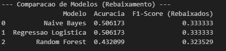
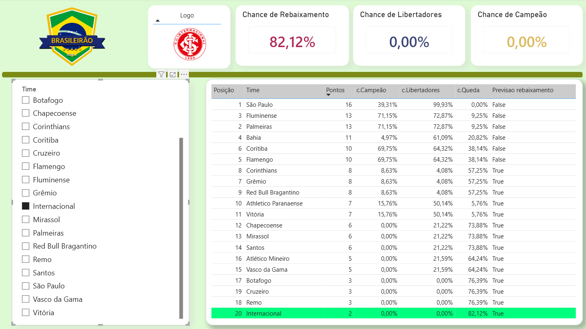
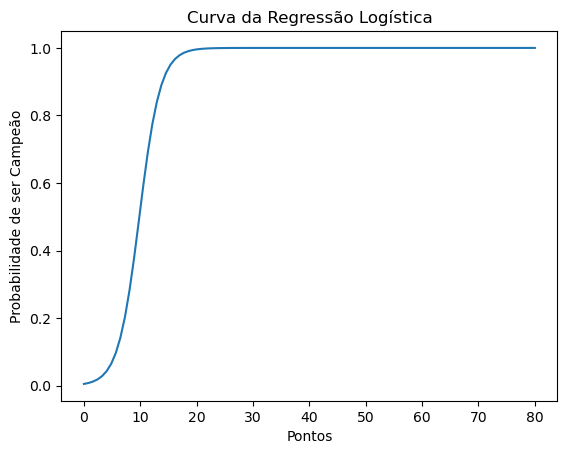

# Previsão do Campeonato Brasileiro (Série A) - 6ª Rodada

## Sobre o Projeto
Este projeto de Ciência de Dados tem como objetivo prever o destino final das equipes(principalmente o Inter), no Campeonato Brasileiro (Série A) com base no desempenho acumulado apenas até a 6ª rodada.

O modelo calcula as probabilidades matemáticas de três cenários:
- Rebaixamento
- Título
- Classificação para a Libertadores

A análise utiliza dados históricos desde 2006 (formato de pontos corridos com 20 times) para treinar modelos de Machine Learning.

O modelo vencedor é então aplicado a dados reais e atuais extraídos via Web Scraping para gerar previsões da temporada corrente (2026), com o objetivo final de alimentar um dashboard no Power BI via MySQL.

---

## Tecnologias Utilizadas

- **Linguagem:** Python  
- **Manipulação de Dados:** Pandas  
- **Machine Learning:** Scikit-learn, Imbalanced-learn (SMOTE)  
- **Coleta de Dados (Web Scraping):** Requests, lxml  
- **Armazenamento e Visualização:** Excel, Power BI  

---

## Arquitetura e Pipeline de Dados

O projeto foi estruturado em 7 etapas sequenciais:

### 1. Importação da Base de Dados
Coleta do histórico completo de partidas do Brasileirão via API do Kaggle.

### 2. Filtro e Tratamento
Padronização dos dados para o formato de 20 times (a partir de 2006) e cálculo de pontos por partida (mandante e visitante).

### 3. Engenharia de Features
Criação de um snapshot do campeonato, isolando a pontuação acumulada de cada equipe estritamente até a 6ª rodada.

### 4. Variáveis Alvo (Targets)
Classificação histórica do destino das equipes no final do campeonato:
- Rebaixado  
- Campeão  
- Top 5 / Libertadores  

### 5. Benchmarking de Modelos
Treinamento e comparação de três algoritmos:
- Naive Bayes  
- Regressão Logística  sws
- Random Forest  

A regressão Logística apresentou a melhor métrica de F1-Score e foi selecionado como preditor oficial.




### 6. Web Scraping e Previsão 2026
Raspagem da tabela de classificação atualizada da Wikipedia, aplicação do modelo regressão Logística treinado e cálculo das probabilidades para a temporada atual.

### 7. Persistência de Dados
Exportação dos resultados finais estruturados em formato CSV para ingestão e consumo no Power BI.

## Conclusão
Este projeto construiu um pipeline de previsão para o Campeonato Brasileiro Série A utilizando dados históricos e modelos de Machine Learning. Mesmo com uma abordagem simples baseada em pontos, modelos como Regressão Logística apresentaram resultados consistentes na identificação de padrões de desempenho.

As métricas indicam que o problema é complexo e ainda há espaço para melhorias, especialmente com a inclusão de novas variáveis e ajustes nos modelos. Ainda assim, o projeto demonstra bem a construção de um pipeline completo, desde os dados até a geração de insights.
:D





### Problemas

Alguns times estão com menos jogos que outros, infelizmente como o bjetivo principal era focar no inter eu mantive a análise já que o mesmo possui os 6 jogos.

Aparecem vários TRUES na tabela rebaixado mas acredito que o problema seja que 40% dos times possuem 5 jogos ou menos e que também ocorreram muitos empates, portando em comparação com a base de dados esse campeonato está se mostrando um com poucos pontos.

---

## Como Executar

### Pré-requisitos
Certifique-se de ter o Python instalado e instale as dependências abaixo:

```bash
pip install pandas scikit-learn imbalanced-learn requests matplotlib kagglehub lxml html5lib
```

### Execução
O código foi desenvolvido em formato de Jupyter Notebook para facilitar a visualização de cada etapa do pipeline.

1. Clone este repositório  
2. Abra o arquivo do notebook  
3. Execute as células sequencialmente do Passo 1 ao Passo 7  
4. O arquivo `previsoes_brasileirao_2026.csv` será gerado no diretório raiz para importação no banco de dados  

É possível utilizar o modelo para analises futuras, basta refazer o passo 3 para a rodada análisada e verificar se o scraper ainda funciona, rodar novamente os 3 modelos de ML e ver qual mais se encaixa e refazer o processamento.

Neste projeto investi 20 horas, e só foi possível graças as aulas de ML do @TeoCalvo 🧙.

Obs: O nome se dá pelas superioridade em vitórias do Internacional em grenais na data do push.